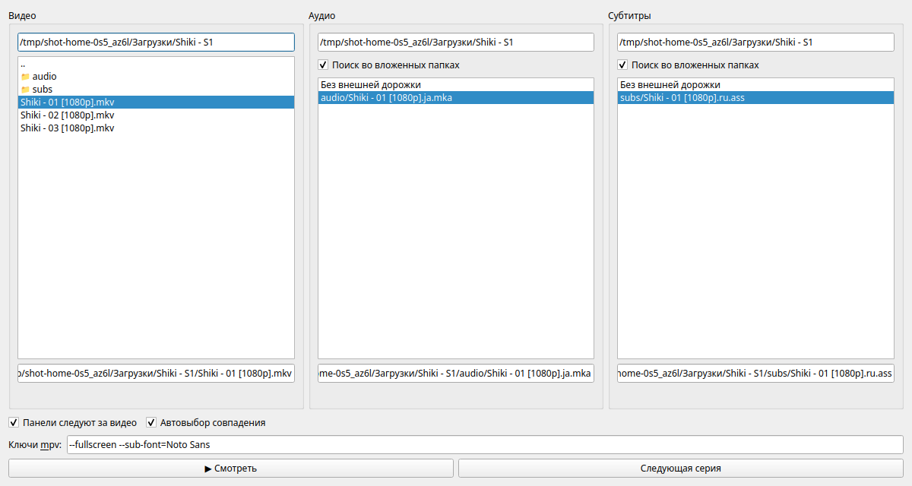

# Media Picker



Небольшое окно на Qt: выбирает локальное видео, при желании подключает к нему внешнюю аудиодорожку
и субтитры и открывает всё это в [mpv](https://mpv.io/). Создано для сериалов, у которых видео,
перевод и сабы лежат разными файлами.

## Установка

Нужны Linux и `mpv` (`sudo apt install mpv`, `sudo dnf install mpv`, `sudo pacman -S mpv`).
Python и Qt подхватывает `uv` сам. Права root не нужны — всё ставится в домашний каталог.

```sh
uv tool install git+https://github.com/IngvarListard/media-picker
```

Другие варианты:

```sh
pipx install git+https://github.com/IngvarListard/media-picker      # через pipx
uv tool install ./media_picker-0.1.0-py3-none-any.whl               # из колеса со страницы релизов
```

Запуск — `media-picker`. Обновление — та же команда установки с `--force` для `uv`
или `pipx upgrade media-picker`. Удаление — `uv tool uninstall media-picker` (или
`pipx uninstall media-picker`) плюс `rm -r ~/.config/MediaPicker`, если настройки больше не нужны.

## Что умеет

- **Три колонки**: Видео, Аудио, Субтитры — файлы только нужных типов, двойной клик входит в папку,
  `..` поднимает наверх. Кнопка «▶ Смотреть» активна, как только выбрано видео; внешние дорожки
  необязательны.
- **Панели следуют за видео**: при выборе серии колонки аудио и субтитров переходят в её папку.
- **Поиск во вложенных папках** в колонках аудио и субтитров: видны файлы из папки видео и всех
  подпапок с тем же именем (`Серия 01.ja.mka` рядом с `Серия 01.mkv`).
- **Автовыбор совпадения**: если подходящая дорожка ровно одна, она выбирается сама; если несколько —
  приложение просит выбрать вручную.
- **Следующая серия**: находит файл, в имени которого ровно одно число увеличилось на 1
  (`S4 - 02 [1080p]` → `S4 - 03 [1080p]`), подставляет к нему дорожки из тех же подпапок и сразу
  запускает mpv.
- **Ключи mpv**: свои параметры запуска, например `--fullscreen --sub-font="Noto Sans" --volume=80`.

Если mpv не установлен, приложение покажет команду установки для вашей системы.

## Настройки

Всё хранится в `~/.config/MediaPicker/MediaPicker.ini` и восстанавливается при следующем запуске:
папки каждой колонки, выбранная серия, обе галочки, ключи mpv, путь к mpv, разрешённые расширения.

- **Ключи mpv** добавляются к каждому запуску, значения задавайте через `=`, значения с пробелами
  берите в кавычки: `--fullscreen --sub-font="Noto Sans" --volume=80`. Команды оболочки, переменные
  и шаблоны файлов не выполняются. Порядок такой: выбранные дорожки → ваши ключи → `--` → видео,
  поэтому ключи могут переопределить выбор панелей (например, `--sid=no` выключает субтитры).
  Незакрытые кавычки и всё, что не похоже на ключ, блокируют запуск с сообщением.
- **Путь к mpv**: если mpv лежит не в `PATH`, укажите его в ключе `options/mpv_path`; пустое
  значение означает поиск в `PATH`.
- **Расширения** можно поменять и перезапустить приложение:

```ini
[extensions]
video=.mkv,.mp4,.webm,.avi
audio=.mka,.mp3,.flac,.aac,.ac3,.eac3,.ogg
subtitle=.ass,.ssa,.srt,.vtt,.sub
```

## Пункт в меню приложений

Необязательно, нужно для запуска мышкой. Файлы берутся из склонированного репозитория:

```sh
git clone https://github.com/IngvarListard/media-picker && cd media-picker
mkdir -p ~/.local/share/applications ~/.local/share/icons/hicolor/256x256/apps
cp packaging/io.github.IngvarListard.MediaPicker.desktop ~/.local/share/applications/
cp packaging/icons/hicolor/256x256/apps/io.github.IngvarListard.MediaPicker.png \
   ~/.local/share/icons/hicolor/256x256/apps/
update-desktop-database ~/.local/share/applications
```

## Разработка

```sh
uv sync
uv run python media_picker.py     # запуск из исходников
uv run python -m unittest discover -s tests
```

Лицензия — MIT. Спеки фич — [specs/](specs).
